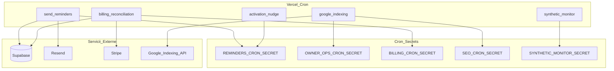

# Evaluare: cron jobs Vercel și dependențe env

Data: 2026-05-18  
Sursă programare: [`vercel.json`](../vercel.json)  
Autentificare cron: [`src/lib/cron-auth.ts`](../src/lib/cron-auth.ts) — `Authorization: Bearer <secret>` sau header `x-cron-secret`

## Rezumat

| Categorie | Număr |
|-----------|------:|
| Job-uri în `vercel.json` | 18 |
| Rute `/api/jobs/*` în repo | 24 |
| Job-uri fără cron Vercel (manual/extern) | 6 |
| Secrete cron distincte | 7 (+ fallback-uri) |

Vercel trimite cron requests cu header-ul de autorizare configurat în proiect (de obicei același secret ca în env).

## Hartă job-uri programate (Vercel)

Orele sunt **UTC** (comportament standard Vercel Cron).

| Schedule (cron) | Path | Secret principal | Fallback secret | Env suplimentar |
|-----------------|------|------------------|-----------------|-----------------|
| `0 8 * * *` | `/api/jobs/send-reminders?type=morning` | `REMINDERS_CRON_SECRET` | — | Supabase, Resend |
| `15 7 * * *` | `/api/jobs/google-indexing` | `SEO_CRON_SECRET` | `OWNER_OPS_CRON_SECRET` | `GOOGLE_INDEXING_*` |
| `0 3 * * *` | `/api/jobs/billing-reconciliation` | `BILLING_CRON_SECRET` | — | Stripe, Supabase |
| `0 3 * * *` | `/api/jobs/cleanup-rate-limits` | `RATE_LIMITS_CRON_SECRET` | — | Supabase |
| `0 4 * * *` | `/api/jobs/cleanup-idempotency-keys` | `REMINDERS_CRON_SECRET` | — | Supabase |
| `0 9 * * *` | `/api/jobs/synthetic-monitor` | `SYNTHETIC_MONITOR_SECRET` | — | `NEXT_PUBLIC_SITE_URL`, slug/login opțional |
| `0 10 * * *` | `/api/jobs/send-emails` | `REMINDERS_CRON_SECRET` | — | Resend, coadă email |
| `0 10 * * *` | `/api/jobs/release-guard` | `RELEASE_GUARD_SECRET` | `OWNER_OPS_CRON_SECRET` | SLO thresholds |
| `15 10 * * *` | `/api/jobs/trial-expiry-warning` | `REMINDERS_CRON_SECRET` | — | Resend |
| `0 11 * * *` | `/api/jobs/send-reminders` | `REMINDERS_CRON_SECRET` | — | Resend |
| `0 12 * * *` | `/api/jobs/winback-cancel-reasons` | `REMINDERS_CRON_SECRET` | — | Resend |
| `30 12 * * *` | `/api/jobs/activation-nudge` | `REMINDERS_CRON_SECRET` | — | Resend, Stripe subs |
| `30 9 * * *` | `/api/jobs/quiet-business-rescue` | `REMINDERS_CRON_SECRET` | — | Resend |
| `0 8 1 * *` | `/api/jobs/monthly-summary` | `OWNER_OPS_CRON_SECRET` | — | email intern |
| `0 8 * * 1` | `/api/jobs/founder-fleet-digest` | `OWNER_OPS_CRON_SECRET` | — | Resend |
| `0 18 * * 0` | `/api/jobs/revenue-report` | `OWNER_OPS_CRON_SECRET` | — | Stripe |
| `0 18 * * 0` | `/api/jobs/weekly-summary` | `OWNER_OPS_CRON_SECRET` | — | Supabase |
| `0 19 * * *` | `/api/jobs/quiet-salon-rescue` | `REMINDERS_CRON_SECRET` | — | Resend |
| `0 20 * * *` | `/api/jobs/send-review-followups` | `REMINDERS_CRON_SECRET` | — | Resend |

### Coliziuni de oră (UTC)

- **03:00** — billing-reconciliation + cleanup-rate-limits (OK, rute diferite)
- **10:00** — send-emails + release-guard (OK)
- **Duminică 18:00** — revenue-report + weekly-summary (OK)

## Job-uri existente dar NU în `vercel.json`

Probabil invocate manual, din scripturi CI sau cron extern:

| Path | Secret | Notă |
|------|--------|------|
| `/api/jobs/send-outreach` | `OUTREACH_CRON_SECRET` | Trimitere email outreach |
| `/api/jobs/sync-outreach-replies` | `OUTREACH_CRON_SECRET` | IMAP reply sync |
| `/api/jobs/outreach-automation` | `OUTREACH_CRON_SECRET` | Automatizare secvențe |
| `/api/jobs/outreach-daily-report` | `OUTREACH_CRON_SECRET` | Raport zilnic |
| `/api/jobs/outreach-approval-reminders` | `OUTREACH_CRON_SECRET` | Reminder aprobări |
| `/api/jobs/import-apify-run` | `OUTREACH_CRON_SECRET` | Import leads Apify |

Documentație outreach: [`OUTREACH_DEPLOY_CHECKLIST.md`](OUTREACH_DEPLOY_CHECKLIST.md)

## Secrete cron — mapare

| Variabilă env | Job-uri tipice | În `.env.example` | Critical (`assertCriticalServerEnv`) |
|---------------|----------------|-------------------|--------------------------------------|
| `REMINDERS_CRON_SECRET` | reminders, emails, cleanup idempotency, trial, rescue, review, activation, winback | Da | **Da** |
| `OWNER_OPS_CRON_SECRET` | weekly/monthly summary, revenue, founder digest, google-indexing (fallback) | Da | Nu |
| `BILLING_CRON_SECRET` | billing-reconciliation | Nu (doar în `env.ts` type) | Nu |
| `OUTREACH_CRON_SECRET` | toate job-urile outreach | Da | Nu |
| `RATE_LIMITS_CRON_SECRET` | cleanup-rate-limits | Da | Nu |
| `SEO_CRON_SECRET` | google-indexing | Da | Nu |
| `RELEASE_GUARD_SECRET` | release-guard | Nu (STAGING_SETUP) | Nu |
| `SYNTHETIC_MONITOR_SECRET` | synthetic-monitor | Nu (STAGING_SETUP) | Nu |

**Recomandare:** adaugă `BILLING_CRON_SECRET`, `RELEASE_GUARD_SECRET`, `SYNTHETIC_MONITOR_SECRET` în [`.env.example`](../.env.example) pentru paritate documentație.

## Env per domeniu funcțional

### Core (aproape toate job-urile)

- `NEXT_PUBLIC_SUPABASE_URL`
- `SUPABASE_SERVICE_ROLE_KEY`
- `NEXT_PUBLIC_SITE_URL`

### Email / notificări

- `RESEND_API_KEY`, `RESEND_FROM`
- `REMINDERS_CRON_SECRET`

### Billing

- `BILLING_CRON_SECRET`
- `STRIPE_SECRET_KEY`, `STRIPE_WEBHOOK_SECRET`, `STRIPE_PRICE_ID`
- `BILLING_ENABLED`

### SEO / indexing

- `SEO_CRON_SECRET` sau `OWNER_OPS_CRON_SECRET`
- `GOOGLE_INDEXING_CLIENT_EMAIL`, `GOOGLE_INDEXING_PRIVATE_KEY`
- `GOOGLE_INDEXING_SITEMAP_URL`, `GOOGLE_INDEXING_DAILY_LIMIT`

### Synthetic monitor

- `SYNTHETIC_MONITOR_SECRET`
- Opțional: `SYNTHETIC_BOOKING_SLUG` / `PLAYWRIGHT_BOOKING_SLUG`
- Opțional: `SYNTHETIC_LOGIN_EMAIL`, `SYNTHETIC_LOGIN_PASSWORD`
- Script local: [`scripts/run-synthetic-monitor.ts`](../scripts/run-synthetic-monitor.ts)

### Outreach (batch separat)

- `OUTREACH_CRON_SECRET`, `OUTREACH_SIGNING_SECRET`
- SMTP: `OUTREACH_SMTP_*`
- IMAP: `OUTREACH_IMAP_*`
- Limite: `OUTREACH_SEND_LIMIT_*`, `OUTREACH_FOLLOW_UP_*`
- `APIFY_TOKEN`, `APIFY_WEBHOOK_SECRET` (import)
- Telegram: `TELEGRAM_*` (aprobat manual)

### Alerte ops

- `ALERT_WEBHOOK_URL`, `ALERT_WEBHOOK_BEARER_TOKEN`, `ALERT_COOLDOWN_MS`

### Raport growth (script, nu cron Vercel)

- `WEEKLY_INTERNAL_EMAILS` — [`scripts/weekly-growth-report.ts`](../scripts/weekly-growth-report.ts)

## Diagramă dependențe



## Verificare operațională

```bash
# Local / staging — exemplu reminder job
curl -sS -X GET "$NEXT_PUBLIC_SITE_URL/api/jobs/send-reminders" \
  -H "Authorization: Bearer $REMINDERS_CRON_SECRET"

# Synthetic (script)
pnpm run ops:synthetic

# SLO release gate
pnpm run ops:slo

# Secrets hygiene
pnpm run verify:secrets
```

Health detaliat: `GET /api/health/detailed` (raportează dacă `REMINDERS_CRON_SECRET` e configurat).

## Riscuri

1. **Secret unic reutilizat** — multe job-uri pe `REMINDERS_CRON_SECRET`; compromiterea expune suprafață largă (acceptabil pentru MVP, dar de separat pe termen mediu).
2. **Job outreach fără cron Vercel** — ușor de uitat la deploy; documentează trigger extern sau adaugă în `vercel.json`.
3. **`BILLING_CRON_SECRET` lipsă din example** — onboarding dev incomplet.
4. **Google indexing fără credențiale** — job rulează dar poate no-op; verifică logs zilnic după deploy.

## Legături

- Flux activare: [`evaluation-signup-to-first-booking.md`](evaluation-signup-to-first-booking.md)
- Runbook: [`../RUNBOOK.md`](../RUNBOOK.md)
- Deploy: [`../DEPLOY.md`](../DEPLOY.md)
