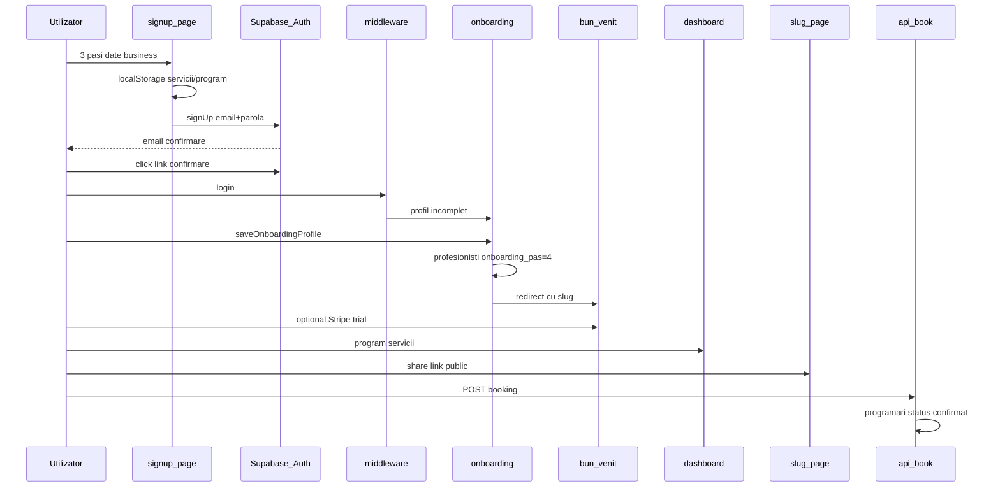

# Evaluare: flux signup → prima programare

Data: 2026-05-18  
Scop: hartă end-to-end a activării profesioniștilor și a primei rezervări publice, cu gap-uri observate.

## Rezumat executiv

| Etapă | Status | Observație |
|-------|--------|------------|
| Signup UI (3 pași) | Funcțional | Colectează business, servicii, program |
| Persistență date signup | **Rezolvat** | `ocupaloc:signupDraft` + `SignupDraftBootstrap` după login |
| Confirmare email | Depinde Supabase Auth | Blochează acces până la confirm |
| Onboarding server | Funcțional | Setează `onboarding_pas = 4` + `onboarding_completed_at` |
| Trial / billing | Opțional | `/onboarding/bun-venit` → Stripe checkout |
| Pagină publică + booking | Funcțional | `/{slug}` + `POST /api/book` + `first_booking_at` |
| Milestone DB | **Rezolvat** | Migrare `050_professional_milestones_backfill.sql` + cod |
| Raport growth săptămânal | **Rezolvat** | Fallback `onboarding_pas >= 4` când lipsește timestamp |

## Diagramă flux



## Pași detaliați

### 1. Înscriere (`/signup`)

- **Fișier:** [`src/app/(auth)/signup/page.tsx`](../src/app/(auth)/signup/page.tsx)
- **Pași UI:** (1) business + activitate + slug, (2) servicii draft, (3) program săptămânal
- **Auth:** `supabase.auth.signUp` (email/parolă); fallback magic link via `/api/auth/signup-fallback`
- **Analytics:** `trackSignup`, `trackOnboardingEvent` (`onboarding_signup_view`, `onboarding_step_completed`, `onboarding_activation`)
- **După submit reușit:** mesaj „Verificați emailul” — **nu** redirect automat la dashboard

**Important (decizie recentă în cod):**

```393:395:src/app/(auth)/signup/page.tsx
    // IMPORTANT: do not run server bootstrap in signup flow.
    // Any transient DB/FK issue here would block onboarding UX.
    // Initial setup is handled safely after login from dashboard actions.
```

`bootstrapTenantAfterSignup` din [`src/app/(auth)/signup/actions.ts`](../src/app/(auth)/signup/actions.ts) **nu mai este apelat** din fluxul de signup.

### 2. Date signup în browser (neconsumate)

La finalizare signup se scriu în `localStorage`:

- `ocupaloc:onboardingServices`
- `ocupaloc:onboardingSchedule`
- `ocupaloc:lastSlug`
- `ocupaloc:lastImportedClients`

**Nu există niciun `getItem` pentru aceste chei în repo** — datele colectate la pașii 2–3 nu ajung în DB prin acest canal.

### 3. Autentificare și gate middleware

- **Fișier:** [`middleware.ts`](../middleware.ts)
- Matcher: `/dashboard/*`, `/onboarding`, `/login`, `/signup`
- Fără sesiune pe `/dashboard` sau `/onboarding` → `/login`
- Cu sesiune pe `/login` sau `/signup` → `/dashboard`
- **Profil complet** = `nume_business` + `tip_activitate` + (`telefon` dacă coloana există) + `onboarding_pas >= 4`
- Cache cookie `_prof_ok` (5 min) pentru profil complet

### 4. Onboarding server (`/onboarding`)

- **Fișier:** [`src/app/onboarding/actions.ts`](../src/app/onboarding/actions.ts)
- Dacă profil deja complet → redirect `/dashboard`
- `saveOnboardingProfile`: insert/update `profesionisti`, setează `onboarding_pas: 4`, slug unic
- Eveniment ops: `onboarding_profile_completed` (flow `onboarding`)
- Redirect: `/onboarding/bun-venit?slug=...`

**Nu setează** `profesionisti.onboarding_completed_at`.

### 5. Bun venit + trial (`/onboarding/bun-venit`)

- **Fișier:** [`src/app/onboarding/bun-venit/BunVenitClient.tsx`](../src/app/onboarding/bun-venit/BunVenitClient.tsx)
- CTA: editare profil, servicii, copiere link public
- Trial: form GET către `/api/billing/create-checkout` (dacă `BILLING_ENABLED`)

### 6. Dashboard (`/dashboard`)

- **Fișier:** [`src/app/(dashboard)/dashboard/page.tsx`](../src/app/(dashboard)/dashboard/page.tsx)
- Fără rând `profesionisti` → `/onboarding`
- `onboarding_pas < 4` → `/onboarding`
- Self-heal: `tenants` + `memberships` (owner) via service role
- Programări manuale: `AddManualBookingDialog` (nu înlocuiește booking public)

### 7. Pagină publică și prima programare client

- **Pagină:** [`src/app/[slug]/page.tsx`](../src/app/[slug]/page.tsx) — `BookingCard`
- **API:** `POST /api/book` → [`src/app/api/book/handler.ts`](../src/app/api/book/handler.ts) → `handleBookRequest` (atomic booking, rate limit, idempotency)
- **Eveniment ops:** `booking_created` / `booking_failed`
- **Slots:** `GET /api/public/slots` (service role pe server)
- Confirmare opțională: `/programare/confirmare`, secret `BOOKING_CONFIRMATION_SECRET`

### 8. Milestone-uri owner / growth

| Milestone | Sursă în cod | Populare actuală |
|-----------|--------------|------------------|
| Cont creat | `profesionisti.created_at` | La insert onboarding |
| Onboarding complet (funnel owner) | `onboarding_completed_at` | **Niciodată scris** |
| Onboarding complet (app) | `onboarding_pas >= 4` | Da |
| Trial / checkout / abonament | `operational_events` flow `billing` | Stripe webhook + checkout |
| Primul booking (funnel API) | `programari` status `confirmat` | La booking reușit |
| `first_booking_at` pe profil | Coloană DB | **Niciodată scris** în `src/` |

Funnel owner: [`src/app/api/owner/analytics/activation-funnel/route.ts`](../src/app/api/owner/analytics/activation-funnel/route.ts)  
Milestone constants: [`src/lib/owner/activation-funnel.ts`](../src/lib/owner/activation-funnel.ts)

Raport săptămânal: [`scripts/weekly-growth-report.ts`](../scripts/weekly-growth-report.ts) folosește `onboarding_completed_at` — poate raporta **0** chiar dacă `onboarding_pas = 4`.

## Criterii „gata de prima programare”

Un profesionist poate primi booking public când:

1. Există `profesionisti` cu `slug` unic și `onboarding_pas >= 4`
2. Există cel puțin un `servicii` activ cu durată/preț valide
3. `program` are intervale active pentru zilele viitoare
4. (Opțional billing) entitlement activ dacă `BILLING_ENABLED=true`

## Recomandări prioritizate

### P0 — Corectitudine date / metrici

1. **Scrie `onboarding_completed_at`** în `saveOnboardingProfile` (și eventual la `bootstrapTenantAfterSignup` dacă e reactivat) la același moment cu `onboarding_pas: 4`.
2. **Backfill SQL** pentru profesioniști existenți: `UPDATE profesionisti SET onboarding_completed_at = created_at WHERE onboarding_pas >= 4 AND onboarding_completed_at IS NULL`.
3. **Aliniază weekly growth report** să folosească `onboarding_pas >= 4` sau timestamp-ul de mai sus.

### P1 — Experiență signup

4. **Consumă sau elimină** pașii 2–3 din signup dacă datele nu sunt persistate (fie reapel `bootstrapTenantAfterSignup` post-login, fie mută colectarea doar în onboarding/dashboard).
5. **Propune slug** din onboarding din `ocupaloc:lastSlug` (client) sau precompletează `nume_business` din signup storage.

### P2 — Prima programare

6. **Setează `first_booking_at`** la primul `programari` confirmat (trigger DB sau în `handleBookRequest`).
7. **Empty state dashboard** dacă `servicii` count = 0 sau program gol — link direct la `/dashboard/servicii`.

## Smoke test manual (15 min)

1. Signup cu email nou → confirmare → login
2. Completează `/onboarding` → ajunge la `/onboarding/bun-venit`
3. Adaugă 1 serviciu în `/dashboard/servicii`
4. Deschide `/{slug}` în incognito → rezervă slot liber
5. Verifică în dashboard programarea `confirmat`
6. Verifică `operational_events` pentru `booking_created`

## Legături

- Cron retention: [`evaluation-cron-jobs-env-map.md`](evaluation-cron-jobs-env-map.md)
- PR split WIP: [`evaluation-uncommitted-pr-split.md`](evaluation-uncommitted-pr-split.md)
- Playbook growth: [`romania-growth-playbook.md`](romania-growth-playbook.md)
