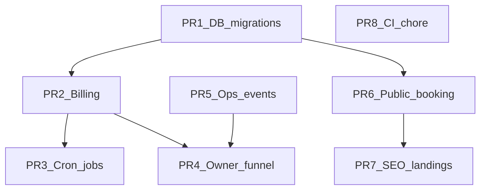

# Evaluare: modificări necomise și propunere PR-uri

Data: 2026-05-18  
Branch: `main` (ultimul commit: `feat(telegram): generate WhatsApp link when phone number is sent`)  
Snapshot: ~132 fișiere touched, ~+4435 / −2880 linii (staged + unstaged + untracked)

**Recomandare:** nu merge un singur PR „mega-WIP”. Împarte în 6–8 PR-uri tematice, ordonate ca mai jos (migrări DB primele).

## Fișiere noi (untracked) — grupare

| Grup | Fișiere cheie |
|------|----------------|
| DB | `supabase/migrations/047_*.sql`, `048_*.sql`, `049_*.sql` |
| Billing | `src/lib/billing/entitlement.ts` |
| Growth jobs | `src/lib/jobs/activation-nudge.ts`, `winback-cancel-reasons.ts`, `google-indexing.ts` + rute API corespondente |
| Owner analytics | `src/lib/owner/activation-funnel.ts`, `src/app/api/owner/analytics/`, `cancel-reasons/` |
| SEO docs | `docs/seo-runbook.md`, `docs/seo-index-queue-next-day.md` |
| Ops taxonomy | `src/lib/ops-event-labels.ts`, `ops-event-taxonomy.ts` |
| Public profile | `src/lib/public-profile-media.ts`, `public-proof.ts` |
| CI / platform | `.github/workflows/db-restore-drill.yml`, `PLATFORM_CHECKLIST.md`, `AGENT_WORKFLOW.md`, PR template |
| Raportare | `scripts/weekly-growth-report.ts`, `reports/` |
| Teste | `tests/send-reminders-concurrency.test.ts` |
| Securitate | `security/secret-history-exception.json` |
| UI auth | `src/app/(auth)/layout.tsx` |
| Demo | `src/app/business-demo/` |

## Propunere PR-uri (ordine merge)

### PR 1 — `db/subscription-guards-and-public-bio`

**Scop:** migrări production-safe, fără logică app dependentă încă.

**Include:**
- `supabase/migrations/047_subscriptions_status_commercial_guard.sql`
- `supabase/migrations/048_subscriptions_status_guard_cleanup_and_validate.sql`
- `supabase/migrations/049_profesionisti_public_add_bio.sql`

**Test plan:** aplică pe staging Supabase; `pnpm run verify:db`

**Risc:** mediu — rulează în fereastră de mentenanță dacă există date inconsistente pe `subscriptions.status`

---

### PR 2 — `billing/entitlements-and-guards`

**Scop:** consolidare entitlement + API billing + dashboard billing UI.

**Include:**
- `src/lib/billing/entitlement.ts`, modificări `entitlements.ts`, `stripe-webhook-service.ts`, `professional-dashboard.ts`
- `src/app/api/billing/*`, `(dashboard)/dashboard/billing/*`, `cancel-subscription-button.tsx`
- Modificări legate de migrări 047–048 în cod (dacă există)

**Exclude:** job-uri growth, SEO, landing pages

**Test plan:** `pnpm run test:ci`, `pnpm run verify:billing`, smoke checkout Stripe preview

---

### PR 3 — `ops/cron-jobs-retention-and-seo`

**Scop:** job-uri noi + `vercel.json` + lib jobs.

**Include:**
- `src/lib/jobs/activation-nudge.ts`, `winback-cancel-reasons.ts`, `google-indexing.ts`
- `src/app/api/jobs/activation-nudge/`, `winback-cancel-reasons/`, `google-indexing/`
- `vercel.json`, `.env.example` (SEO + cron secrets)
- `src/lib/config/env.ts` dacă doar pentru aceste job-uri

**Test plan:** curl job cu secret pe preview; verifică logs Vercel cron

**Dependență:** după PR 2 dacă job-urile citesc subscriptions

---

### PR 4 — `owner/activation-funnel-and-cancel-reasons`

**Scop:** vizibilitate founder pentru conversie.

**Include:**
- `src/lib/owner/activation-funnel.ts`, `src/app/api/owner/analytics/activation-funnel/`
- `src/app/api/owner/billing/cancel-reasons/`
- `(owner)/owner/*` pages atinse (dashboard, subscriptions, operations)
- `src/lib/owner/data.ts`, `stats.ts`

**Test plan:** login owner pe staging; GET funnel API; UI smoke

**Notă:** aliniază cu recomandarea din [evaluation-signup-to-first-booking.md](evaluation-signup-to-first-booking.md) — populate `onboarding_completed_at`

---

### PR 5 — `growth/ops-events-and-weekly-report`

**Scop:** taxonomie evenimente + raport intern.

**Include:**
- `src/lib/ops-event-labels.ts`, `ops-event-taxonomy.ts`
- `src/lib/analytics.ts`, `src/app/api/ops/*`
- `scripts/weekly-growth-report.ts`, `reports/weekly-growth-latest.md` (sau gitignore `reports/` dacă e generat)
- `analyze-real-data.mjs`, `check-services.mjs`

**Exclude:** modificări masive landing SEO

---

### PR 6 — `product/public-profile-and-booking-ux`

**Scop:** pagini publice, booking card, confirmare.

**Include:**
- `src/lib/public-profile-media.ts`, `public-proof.ts`
- `src/app/[slug]/*`, `src/components/booking/BookingCard.tsx`
- `src/app/programare/confirmare/page.tsx`
- `src/app/(auth)/layout.tsx`, `signup/page.tsx`, `reset-password-form.tsx`
- `src/app/onboarding/*`, `(dashboard)/dashboard/page.tsx`, `actions.ts`, `setari/page.tsx`

**Test plan:** `tests/e2e/public-booking-smoke.spec.ts`, booking flow e2e

---

### PR 7 — `marketing/seo-landings-and-sitemap`

**Scop:** conținut SEO și robots/sitemap — review separat (diff mare, risc SEO).

**Include:**
- `src/app/programari-online-*/page.tsx`, `alternativa-fresha-romania`, `blog/*`, `preturi`, `despre`, `layout.tsx`, `page.tsx`
- `src/app/robots.ts`, `sitemap.ts`
- `docs/seo-runbook.md`, `docs/seo-index-queue-next-day.md`
- `src/components/landing/LandingPage.tsx`, `LegalPage.tsx`

**Test plan:** `pnpm run build`; verifică manual sitemap XML pe preview

---

### PR 8 — `chore/ci-platform-and-reminders-test`

**Scop:** infrastructură, fără logică produs.

**Include:**
- `.github/workflows/ci.yml`, `deploy-staging.yml`, `security.yml`, `db-restore-drill.yml`
- `PLATFORM_CHECKLIST.md`, `AGENT_WORKFLOW.md`, `.github/pull_request_template.md`
- `CONTRIBUTING.md`, `DEPLOY.md`, `RUNBOOK.md`, `RELEASE_RUNBOOK.md`
- `scripts/check-secrets.ts`, `check-slo-release-gate.ts`, `run-synthetic-monitor.ts`
- `tests/send-reminders-concurrency.test.ts`
- `security/secret-history-exception.json`
- `package.json`, `pnpm-lock.yaml` (doar dacă deps pentru PR-urile de mai sus)
- `coverage/lcov-report/*` — **exclude din PR** (artefact generat)

**Test plan:** CI verde pe PR

---

### Opțional PR 9 — `demo/business-demo-page`

**Izolat:** `src/app/business-demo/` — poate rămâne preview-only.

## Fișiere de exclus din orice PR

| Path | Motiv |
|------|--------|
| `coverage/lcov-report/**` | Generat local |
| `reports/*.md` | Generat de script (sau commit doar template `.gitkeep`) |
| `.env`, `.env.local` | Secrete |

## Dependențe între PR-uri



## Comenzi utile pentru split (git)

```bash
# Exemplu: branch doar migrări
git checkout -b db/subscription-guards-and-public-bio
git add supabase/migrations/047_*.sql supabase/migrations/048_*.sql supabase/migrations/049_*.sql
# commit, push, gh pr create

# Pentru restul: git add -p sau checkout paths selective din stash
```

Dacă tot WIP-ul e pe `main` local, consideră:

```bash
git stash push -u -m "wip-evaluation-split"
git checkout -b db/subscription-guards-and-public-bio
git stash pop
# apoi add selectiv
```

## Checklist înainte de primul PR

- [ ] `pnpm run check:local` pe fiecare branch
- [ ] Migrări rulate pe staging înainte de deploy app
- [ ] Env noi în Vercel (Production + Preview): `SEO_CRON_SECRET`, `GOOGLE_INDEXING_*`
- [ ] Actualizat [`DOCS_INDEX.md`](DOCS_INDEX.md) (deja pentru evaluări)

## Legături

- [evaluation-signup-to-first-booking.md](evaluation-signup-to-first-booking.md)
- [evaluation-cron-jobs-env-map.md](evaluation-cron-jobs-env-map.md)
- Skill split: `.cursor/skills-cursor/split-to-prs/SKILL.md` (dacă folosești agent pentru automatizare)
